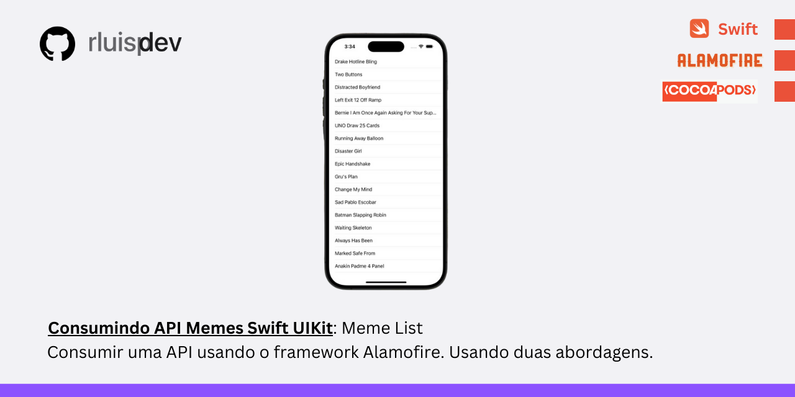

# MemeList

 Bem-vindo ao MemeList, um projeto iOS desenvolvido em Swift que utiliza a API pública de memes do Imgflip.

 ## 🔨 Funcionalidades

* Visualização de Memes: Apresenta uma lista de memes carregados de uma API pública, exibindo o nome de cada meme.
* Recarga de Conteúdo: Realiza requisições para atualizar a lista de memes exibidos.
*  Manipulação de Dados: Gerencia os dados dos memes com o uso de models e parsing de JSON.

 ## ✔️ Técnicas e Tecnologias Utilizadas

### Linguagem de Programação: Swift
###  Frameworks e Bibliotecas:

   * Alamofire (via CocoaPods): para manipulação de requisições HTTP
   * UIKit: interface e manipulação de UI 

### Design de Código:

   * Modelos de dados customizados para representar memes
   *  Parsing de JSON para transformar dados da API em objetos Swift
   * Requisições assíncronas com closures e protocolos

### Controle de Versão: Git e GitHub

# 💻 Como Executar o Projeto

1. Clone este repositório:

```
git clone https://github.com/rluispdev/memehub-api.git
```

2. Abra o projeto no Xcode e instale as dependências via CocoaPods:

```
pod install
```

3 - Execute a aplicação no simulador do Xcode.

# 📈 Melhorias Futuras

   * Pesquisa: Adicionar funcionalidade para busca de memes por nome.
   * Tela para exibir os memes


## ❇️ Live Consumindo API com Swift - Backfront Academy
-  [Live no Youtube](https://www.youtube.com/watch?v=SfOZ9Bd9eyU&t=3560s)

## 👨‍💻 Student

<p>
    
    <p>&nbsp&nbsp&nbsprluispdev<br>
    &nbsp&nbsp&nbsp
    <a href="https://github.com/rluispdev">
    GitHub</a>&nbsp;|&nbsp;
     <a href="https://cursos.alura.com.br/user/rluisp"> Alura Profile</a>
&nbsp;|&nbsp;
    <a href="https://www.linkedin.com/in/rafael-luis-gonzaga-b11634186/">LinkedIn</a>
&nbsp;|&nbsp;
    <a href="https://www.instagram.com/rluispdevs?igsh=cnoxenpmaHY1amE0&utm_source=qr">
    Instagram</a>
&nbsp;|&nbsp;</p>
</p>
<br/><br/>
<p>


